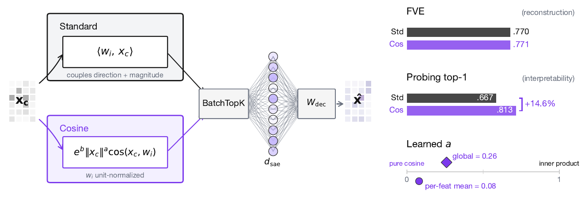
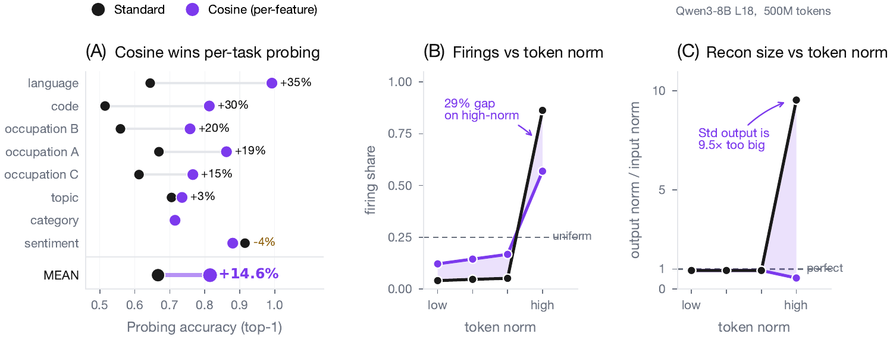

# Cosine-Scored Sparse Autoencoders

Code supplement for **"Size Doesn't Matter: Cosine-Scored Sparse Autoencoders"**.

**Spotlight** at the ICML 2026 Mechanistic Interpretability Workshop. Interactive article: [silennaihin.github.io/cosine-scored-saes](https://silennaihin.github.io/cosine-scored-saes/) · Paper and reviews: [OpenReview](https://openreview.net/forum?id=7ZmZhrlbnu).



*The cosine encoder swaps the inner-product score `⟨w_i, x_c⟩` for `e^b · ‖x_c‖^a · cos(x_c, w_i)` with unit-normalized encoder rows. At matched reconstruction (FVE 0.770 vs 0.771), it improves sparse-probing top-1 by +14.6%; the learned norm-dependence converges to `a ≈ 0.26` (global), far below inner product.*

## Abstract

Sparse autoencoders (SAEs) detect features via inner product, so a feature's activation scales with both its directional alignment and the input's norm. Under BatchTopK, high-norm tokens inflate all pre-activations simultaneously, claiming dictionary slots regardless of content alignment. This matters because sublayer normalization has already discarded the magnitude the score measures, so the encoder detects a quantity the model does not read. We replace the score with a learned blend of cosine similarity and input magnitude, letting the optimizer choose how much norm to use; a per-feature extension lets each feature decide independently. In both regimes, training is free to recover inner product but never does, with no feature ever choosing more than half-magnitude dependence. At matched reconstruction, the cosine encoder learns features that align with human-recognizable concepts far more often than standard, filling dictionary slots that inner product wastes on norm detectors. Loss reweighting that equalizes gradients barely closes the gap, confirming forward-pass score geometry as the lever. The advantage is not universal across tasks or depths, but we believe cosine scoring should be the default for dictionary learning on normalized representations.

## Overview

Standard sparse autoencoders (SAEs) score features by inner product: a feature's activation scales with both its directional alignment and the input token's norm. In models with pre-layer RMSNorm, downstream sublayers strip magnitude before reading the residual stream — so the inner-product score encodes information the model has already discarded. Under BatchTopK selection, this causes high-norm tokens to inflate all pre-activations, driving ~86% of features to converge to norm detectors rather than content encoders.

We replace the inner-product score with a cosine score scaled by a learned norm-dependence exponent that interpolates between cosine (a=0) and inner product (a=1). On Qwen3-8B with 500M FineWeb tokens, the cosine encoder matches reconstruction (FVE ≈ 0.77) and improves single-feature sparse-probing top-1 by **+14.9%**. A matched-feature decomposition shows ~87% of the gap comes from features the standard encoder fails to learn, not from better separability. The learned exponent consistently converges below 0.3, confirming the optimizer discounts magnitude.

## Repository Structure

```
cosine-scored-saes/
├── benchmarks/          # SAEBench adapter and evaluation infrastructure
├── experiments/         # All 60+ experiments (scripts, results, logs)
│   ├── 01_layernorm_erasure/
│   ├── 02_magnitude_confound/
│   ├── ...
│   └── 60_decoder_geometry/
├── README.md
└── experiments.md       # Experiment index with results summaries
```

## Key Results

| Metric | Standard SAE | Cosine SAE | Gap |
|--------|-------------|-----------|-----|
| Sparse probing top-1 | 0.667 | 0.815 | **+14.9%** |
| Sparse probing top-5 | 0.783 | 0.889 | **+10.6%** |
| FVE (reconstruction) | 0.770 | 0.772 | matched |
| Q4 FVE (high-norm tokens) | -184 | +0.33 | fixed |
| Content-encoding features | 13.4% | ~100% | 7.5× |
| Per-feature interpretability | 82.1% | 80.1% | matched (p=0.88) |

*Qwen3-8B, layer 18, 500M FineWeb tokens, d_sae=65,536, BatchTopK k=80.*



*Cosine scoring wins per-task sparse probing (+14.6% mean top-1); standard inner-product SAEs fire disproportionately on high-norm tokens (29% gap) and inflate reconstruction size (9.5×), while cosine features track content instead.*

## Models and SAEs

- **Primary model:** Qwen3-8B (RMSNorm, d_model=4096)
- **Cross-model:** Gemma-2-2B, Mistral-7B, Pythia-70M/2.8B/6.9B, Falcon-7B
- **SAE training:** BatchTopK (k=80), Adam (lr=5e-5), aux-k dead-feature loss (α=1/32), decoder unit-norm + gradient projection, 500M FineWeb tokens
- **Evaluation:** SAEBench (sparse probing, absorption, SCR, TPP, core metrics)
- **Reference SAE:** [adamkarvonen/qwen3-8b-saes](https://huggingface.co/adamkarvonen/qwen3-8b-saes)
- **Our SAEs:** [Silen/cosine-scored-saes-qwen3-8b](https://huggingface.co/Silen/cosine-scored-saes-qwen3-8b) — the 500M-token headline checkpoints (standard, global-`a`, per-feature) at Qwen3-8B layer 18, `d_sae=65,536`.

## Architecture

The cosine-scored encoder replaces the standard pre-activation:

```
Standard:  s_i(x) = <w_i, x_c> + b_i         = ||x_c|| · cos(x_c, w_i) + b_i
Cosine:    s_i(x) = e^b · ||x_c||^a · cos(x_c, w_i) + b_i
```

where `a` interpolates between pure cosine (a=0) and inner product (a=1), and `b` is a global scale. Encoder rows are unit-normalized. A per-feature extension parameterizes `a_i = a_base + δ_i`.

## Recommendations

**Architecture choice.**

- **Adaptive Cosine SAE:** 0% dead with the auxiliary loss at 500M; one extra `log‖x_c‖` + `exp` per token; +13.3% top-1.
- **Per-Feature Adaptive Cosine SAE:** highest top-1 at 500M (+14.9%); 83% dead at 50M / L27.
- **Magnitude-Bypass SAE:** largest cos-vs-inner score difference; 4.3% persistent dead with the auxiliary loss.
- **Standard:** top-1 0.915 on amazon_sentiment.

**Initialization.** Default `b = log√d_model`, `a = 0`. If `mean‖x_train − b_dec‖` is more than ~2× from `√d_model`, switch `b` to `log(mean‖x‖)` (required for Mistral-class models with `‖x‖ ≈ 6`).

**Sparsity, loss, training-time monitoring.** Keep BatchTopK; keep the auxiliary loss for production use. The auxiliary loss has no effect on Magnitude-Bypass SAE at 5M (gradients through bounded `[0, 1]` activations are too small); the rescue effect emerges between 5M and 500M. During the first 5% of training, monitor `a` (or the `{a_i}` histogram): `a` stuck near 0 with norm-adaptive init at large data means revert to `√d` init; `a` drifting toward 1 means reconsider initialization.

**Before deploying.** Verify that the eval activation-norm distribution matches training. Cosine FVE drops 4.5–5.8% under Uniform(0.5, 2.0) norm noise vs. 1.8–3.4% for Standard (see Limitations).

**Out of scope.**

- Shallow layers of small models (cos > inner < 50%).
- Deep LayerNorm models without RMSNorm-equivalent geometry.
- Tasks where magnitude is the operative signal (sentiment intensity, perplexity surprise).
- QK-normalized attention, per-head normalization, and nGPT: not tested.

## Reproducing

Each experiment folder contains the training/evaluation script and its results. Experiments are designed to run on a single GPU (A100 80GB or H100 80GB). Key dependencies:

```
torch >= 2.1
transformers
datasets
sae-bench  # for SAEBench evaluations
```

## Experiment Progression

See [experiments.md](experiments.md) for the full experiment index with results summaries.

## Bottom Line

The advantage is not universal across tasks or depths, but the inner-product score measures a magnitude the model has already normalized away; on representations with pre-layer RMSNorm, that magnitude is wasted dictionary capacity. **We recommend cosine scoring as the default for dictionary learning on normalized representations**, with the per-feature adaptive variant when discovery and sparse-probing quality matter most.

## Citation

```bibtex
@inproceedings{cosine-scored-saes-2026,
  title     = {Size Doesn't Matter: Cosine-Scored Sparse Autoencoders},
  booktitle = {ICML 2026 Mechanistic Interpretability Workshop (Spotlight)},
  year      = {2026},
  url       = {https://openreview.net/forum?id=7ZmZhrlbnu}
}
```

## License

MIT
